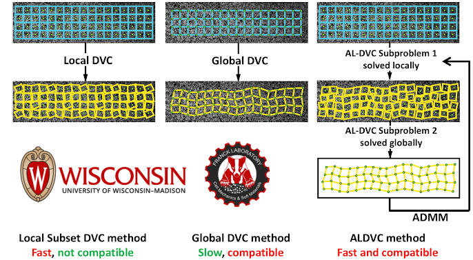

Welcome to Augmented Lagrangian Digital Volume Correlation (ALDVC) Documentation
===================================

Welcome to the documentation for the Augmented Lagrangian Digital Volume Correlation (ALDVC) code package! Here you will find tutorials, articles, and links to the software manuals. Browse through the available articles using the links to the side.

- Page :ref:`introduction` introduces main differences and advantages of the ALDVC method compared to other conventional DVC method.

- :ref:`gettingstarted` will help you download the software, install it, and subscribe any future updates.

- The :ref:`firstcase` page will help you with many basic and advanced topics including topics such as: performing your first ALDVC analysis

- The :ref:`FAQ <faq>` page contains common questions that we received during the past years from our users.

.. note::

   This project is under active development.

.. toctree::
   :maxdepth: 2
   :caption: Contents:

   pages/introduction
   pages/gettingstarted
   pages/firstcase
   pages/faq

Indices and tables
-----------

* Source code: https://github.com/jyang526843/ALDVC_doc/tree/1.2
* Home page: https://aldvc-doc.readthedocs.io/en/latest/index.html
* Other links
* Contact: Dr. Jin Yang, jin.yang@austin.utexas.edu

.. include:: introduction.rst
.. include:: gettingstarted.rst
.. include:: firstcase.rst
.. include:: faq.rst

