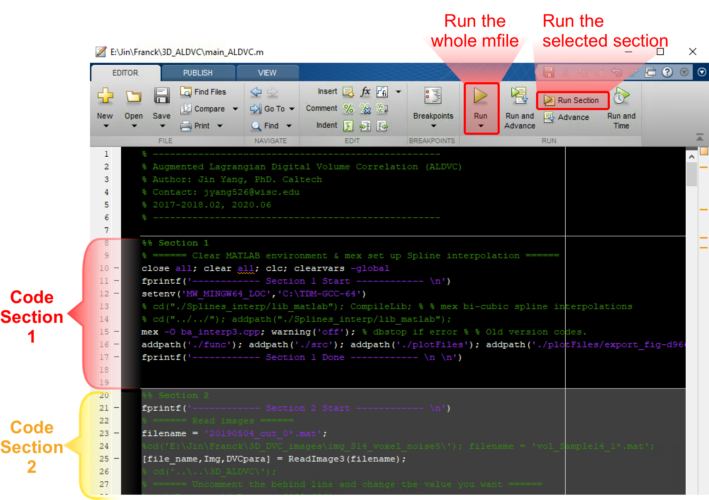
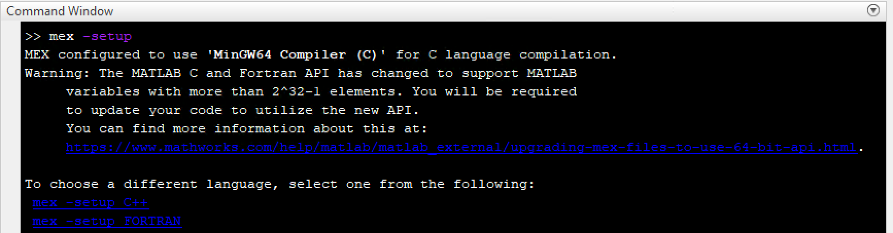
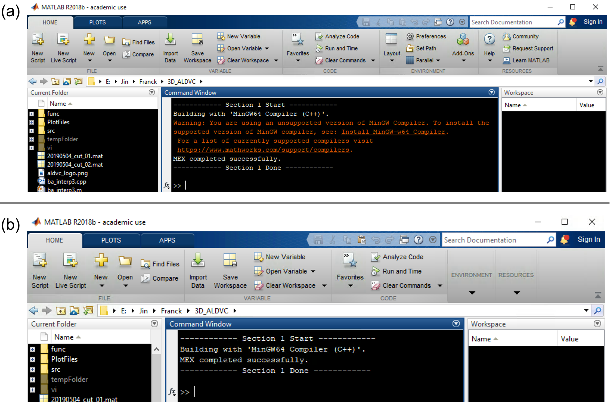

.. _gettingstarted:

==================
Getting Started
==================

Installation
----------------

To install ALDVC on your machine:

* Make sure that MATLAB (version later than 2018a) is already installed on your machine. Both Windows (later than Windows 10) and Mac OS have been tested;

* Download and unzip our code package from Mathworks File Exchange `[ALDIC Mathworks link]`_ or Github page `[ALDIC Github link]`_;

* Open your MATLAB app, enter the unzipped ALDVC folder, and set it on your MATLAB working path;

* Make sure these MATLAB toolboxes are installed on your computer:

    * Parallel computing toolbox

    * Wavelet

    * Imaging post-processing

* ALDVC code can be initiated by opening and executing the "main_ALDVC.m" file. As shown in :numref:`img_main_ALDVC`. ALDVC code can be executed section by section. Once you are familiar with the ALDVC code, you can execute the whole main file by clicking the "Run" button to run the whole file at one time ("EDITOR >> RUN >> |runbutton|"). ALDIC code is easy to modify based on user``s custom parameter choice. In this code manual, we will introduce ALDVC code section by section.

.. _img_main_ALDVC:

   Main file of ALDVC code "main ALDVC.m". Each section can be executed in order by clicking "Run Section".

Volumetric Image Stack Pre-processing
----------------

To apply digital volume correlation, we need to provide at least two image stacks to compare and
register unknown deformations. These image stacks could be generated from various diagnostic
techniques, e.g., 3D confocal microscopy, X-ray tomography (CT) scans, magnetic resonance
imaging (MRI), neutron tomography, etc.

Here we assume the user has 3D image stacks for both undeformed and deformed images.
(Though your raw data sets are not in image stacks, there are lots of free software, e.g., Fiji(https://imagej.net/Fiji), ImageJ or other image processing softwares, to export 3D image stacks.)
For example, in the subfolder "./DVC images/vol stretch tiff" there are one example of such a 3D
image stack corresponding to the "vol stretch 1001.mat" in the "ImageDownload link.txt".

We provide a MATLAB script "./DVC images/GenerateVolMatfile.m" to transfer such image stacks to ALDVC input matfiles. (User needs to modify this script a little bit where are marked with ``TODO:`` based on his/her data sets).

Currently, we recommend the user to save each 3D image stack into one "vol" MATLAB matfile,
and always export the reference image as the first vol matfile.

.. note::

   The "x-, y-, z-" or "1-, 2-, 3-" or "first, second, third" coordinates in the ALDVC code always correspond to the 1st, 2nd and 3rd indices of Matlab workspace variable. For example, ``p_meas(:,1)`` and ``p_meas(:,2)`` are the x- and y-coordinates of scattered points ``p_meas``. This is different from some MATLAB image processing functions. For example, if a 3D image has size M x N x L, in this code, we always have the image size with size x = M, size y = N, and size z = L. If you use some MATLAB computer vision or image post-processing functions, for example, "imagesc3D", or "imshow3D", or "surf", it will reads as size x = N, size y = M, and size z = L.

   At the end of the "./DVC images/GenerateVolMatfile.m" and in the subfolder "./PlotFiles/", you will find that there are two functions "imagesc3.m" and "imagesc3D.m". As mentioned before, ``imagesc3(vol1);`` is equivalent to ``imagesc3D(permute(double(vol1),[2,1,3]));``
Please pay attention to this difference.

MATLAB mex setup (ALDVC Code Section 1)
----------------

Executing the first section of the ALDVC mail file will try to build “mex" functions from C/C++ source codes for image
grayscale value interpolation, where linear, tri-cubic (by default) and tri-cubic splines interpolations
are implemented in this code. For example, by default we use tri-cubic interpolations where the
associated mex set up file is called “ba interp3.cpp" `[ba_interp3 link]`_.

Test MATLAB mex setup
^^^^^^^^^^^^^^^^

Fist, it will be a good idea to test whether there is already a C/C++ compiler installed on your computer by inputting
mex -setup and press Enter key on the MATLAB command window. If an available C/C++ compiler
is already installed, please skip Section 4.2 and jump to Section 4.3.

Install mex C/C++ compiler
^^^^^^^^^^^^^^^^^^^^

The step of installing the mex C/C++ compilers is a common step for users to run C/C++ codes with
MATLAB. Mac users usually do not come across the error message from mex C/C++ compilers.
For Windows users, you can follow these steps to install mex C/C++ compiler. More details can
be found in `[MinGW-w64 C/C++ Compiler MATLAB Support]`_ `[MinGW-w64 Compiler]`_.

- **Download** TDM-gcc compiler from: http://tdm-gcc.tdragon.net/

- **Install** TDM-gcc compiler on your computer. For example, it can be installed at ``C:\TDM-GCC-64`` [*]_.

- **Restart** MATLAB and input these codes on the command window to check whether **mex** is set up successfully or not. Do not forget to replace the above **YourTDMGCCPath** using your own installation location of TDM-gcc package in the last step.

    >>> setenv('MW_MINGW64_LOC','YourTDMGCCPath');
    >>> mex -setup;

- If it is already installed in ``C:\TDM-GCC-64``, please replace previous **YourTDMGCCPath** with ``C:\TDM-GCC-64``. If a mex C/C++ compiler is installed successfully, you will see a message similar to :numref:`img_mexCheck` to display on your MATLAB command window.

- Alternatively, the MinGW mex compiler can be downloaded from the MATLAB **Add-Ons** library and installed per the MATLAB documentation. In this case, comment out the setenv line in section 1.

.. _img_mexCheck:

   A message displayed on the command window when a mex C/C++ compiler is installed successfully.

Execute code Section 1
^^^^^^^^^^^^^^^^^^^^^^^^^^^^

Once a mex C/C++ compiler is installed, we can execute main ALDVC.m code Section 1 and a
successful message will display on the MATLAB command window, see :numref:`img_ex_sec1`.

.. _img_ex_sec1:

   ALDVC code Section 1 is executed successfully and a message similar to (a) or (b) will display on the command window.

References
-----------

.. _[ALDIC Mathworks link]:

2D ALDIC MATLAB code Mathworks FileExchange link. https://www.mathworks.com/matlabcentral/fileexchange/70499-augmentedlagrangian-digital-image-correlation-and-tracking.

.. _[ALDIC GitHub link]:

2D ALDIC MATLAB code Github link. https://github.com/jyang526843/2D_ALDIC.

.. _[ba_interp3 link]:

3D Volume Interpolation with ba interp3. https://www.mathworks.com/matlabcentral/fileexchange/21702-3d-volume-interpolation-with-ba_interp3-fast-interp3-replacement.

.. _[MinGW-w64 C/C++ Compiler MATLAB Support]:

MATLAB Support for MinGW-w64 C/C++ Compiler. https://www.mathworks.com/matlabcentral/fileexchange/52848-matlab-support-for-mingw-w64-c-c-compiler.

.. _[MinGW-w64 Compiler]:

MathWorks: MinGW-w64 Compiler. https://www.mathworks.com/help/matlab/matlab_external/install-mingw-support-package.html.

.. [*] In practice, we find that this TDM-gcc compiler only works if installed on the first level main disks, such as ``C:\``, ``D:\``, ``E:\``, etc.

