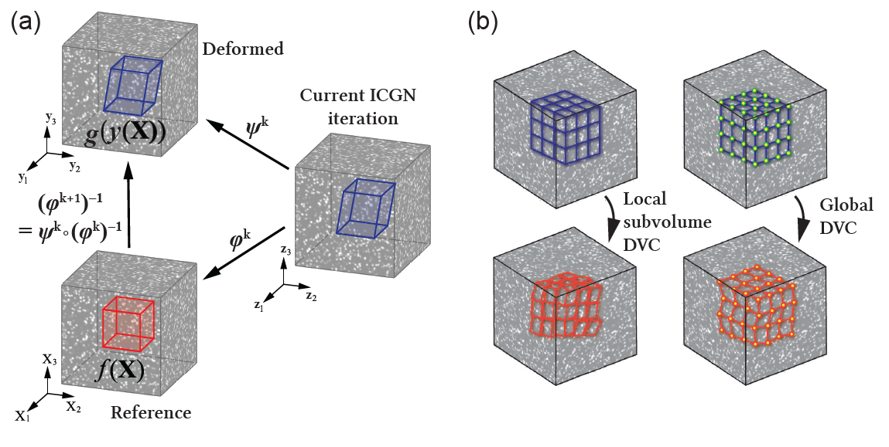

.. _introduction:

=====
Introduction
=====

Digital volume correlation (DVC), the volumetric extension of the popular digital image correlation
(DIC) technique, is a powerful experimental tool for measuring 3D volumetric full-field displacements
and strains. Most current DVC algorithms can be categorized into either local or finite-element-based global methods. As with most experimental approaches, there are drawbacks with
each of these methods. In the local method the subvolume deformations are estimated independently
and the computed displacement field may not necessarily be kinematically compatible.
Therefore, the deformation gradients can be noisy, especially when using small volumetric subsets.
Although the global method often enforces kinematic compatibility, it generally incurs substantially
greater computational costs than its local counterpart, which is especially significant for large volumetric data sets.

Here we present a new hybrid DVC algorithm, called augmented Lagrangian
digital volume correlation (ALDVC) `[1]`_, which combines the advantages of both the local (fast computation
times) and global (compatible displacement field) methods. This new algorithm builds on
our recent work on the augmented Lagrangian digital image correlation (2D-ALDIC) technique `[2]`_
(2D-ALDIC MATLAB code is avalable on Mathworks File Exchange: `[3]`_) and solves the general motion optimization problem by using the alternating direction method of multipliers (ADMM) `[4]`_. We demonstrated that our ALDVC algorithm has high accuracy and precision while maintaining low computational cost, and is a significant improvement compared to current local and global DVC methods `[1]`_. For a review of both local and global DVC methods, and details of this new proposed ALDVC
method, please see :ref:`Fig. 1` and our paper `[1]`_ (full text can also be accessed here `[5]`_).

Some advantages of our ALDVC algorithm are highlighted below:

    * [i] It is a *fast* algorithm using *distributed parallel* computing for a global nonconvex optimization.
    * [ii] *Global kinematic compatibility* is added as a global constraint in augmented Lagrangian form, and solved using the *Alternating Direction Method of Multipliers (ADMM)* scheme.
    * [iii] Both displacement fields and affine deformation gradients are computed at the same time.
    * [iv] Since global compatibility is enforced the user does not need to choose a specific displacement smoothing filters.
    * [v] It works well with compressed images and can include *adaptive mesh* refinement `[6]`_.
    * [vi] It can solve an image sequence with multiple time frames and handle large finite deformations.

.. _target to image:

(a) Schematic showing a volumetric DVC reference image f(X), with a general speckle
pattern, deforming into the deformed image g(y(X)) under some mapping y and the change of
variables involved within the IC-GN iteration in the local subvolume DVC method. X and y coordinates are in the reference and deformed images, respectively. z coordinates are in current IC-GN iteration. (b) A schematic comparison between the local DVC method (left), where all the subvolumes are analyzed independently, and the global DVC method (right), where a global basis set is used to represent the full-field deformation.

-----
References
-----

.. _[1]:

[1] J Yang, L Hazlett, A.K. Landauer, and C. Franck. Augmented Lagrangian Digital Volume Correlation. Experimental Mechanics, 60:1205-1223, 2020.

.. _[2]:

[2] J Yang and K Bhattacharya. Augmented Lagrangian Digital Image Correlation. Experimental Mechanics, 59:187-205, 2019.

.. _[3]:

[3] 2D ALDIC MATLAB code. https://www.mathworks.com/matlabcentral/fileexchange/70499-augmentedlagrangian-digital-image-correlation-and-tracking.

.. _[4]:

[4] S Boyd, N Parikh, E Chu, B Peleato, and J Eckstein. Distributed optimization and statistical learning via the alternating direction method of multipliers. Machine Learning, 3:1-122, 2010.

.. _[5]:

[5] ResearchGate link for "Augmented Lagrangian Digital Volume Correlation": https://www.researchgate.net/publication/343676441.

.. _[6]:

[6] J Yang and K Bhattacharya. Combining image compression with digital image correlation. Experimental Mechanics, 59:629-642, 2019.

.. _[7]:

[7] 3D Volume Interpolation with ba_interp3. https://www.mathworks.com/matlabcentral/fileexchange/21702-3d-volume-interpolation-with-ba_interp3-fast-interp3-replacement.

.. _[8]:

[8] MATLAB Support for MinGW-w64 C/C++ Compiler. https://www.mathworks.com/matlabcentral/fileexchange/52848-matlab-support-for-mingw-w64-c-c-compiler.

.. _[9]:

[9] MathWorks: MinGW-w64 Compiler. https://www.mathworks.com/help/matlab/matlab external/install-mingw-support-package.html.

.. _[10]:

[10] E Bar-Kochba, J Toyjanova, E Andrews, K-S Kim, and C Franck. A fast iterative digital volume correlation algorithm for large deformations. Experimental Mechanics, 55:261-274, 2015.

.. _[11]:

[11] AK Landauer, M Patel, DL Henann, and C Franck. A q-factor-based digital image correlation algorithm (qDIC) for resolving finite deformations with degenerate speckle patterns. Experimental Mechanics, 58:815-830, 2018.

.. _[12]:

[12] FIDVC code. https://github.com/FranckLab/FIDVC.

.. _[13]:

[13] qFIDVC code. https://github.com/FranckLab/qFIDVC.

.. _[14]:

[14] MathWorks Help Center: parpool. https://www.mathworks.com/help/distcomp/parpool.html.

.. _[15]:

[15] PL Reu, E Toussaint, E Jones, HA Bruck, M Iadicola, R Balcaen, DZ Turner, T Siebert, P Lava, and M Simonsen. DIC challenge: Developing images and guidelines for evaluating accuracy and resolution of 2D analyses. Experimental Mechanics, 58:1067-1099, 2018.

